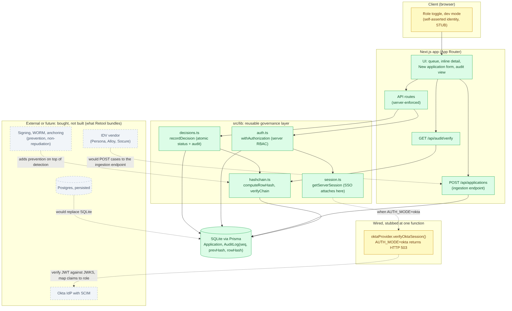

# Architecture: KYC Review Queue Prototype

**Goal:** rebuild the review workflow of a Retool-style KYC queue, and show which parts are cheap to build in-house and which parts are the governance features Retool actually sells.

Green is built. Yellow is wired but stubbed at one function. Grey and dashed is external, bought rather than built. Source: [`architecture.mmd`](./architecture.mmd).

**Stack:** Next.js (App Router, TS) with Prisma and SQLite. Governance logic sits in four modules under `src/lib/` rather than being spread through the screens: `session.ts` (`getServerSession`, where SSO plugs in), `auth.ts` (`withAuthorization`, server-side RBAC returning 401/403/503), `decisions.ts` (`recordDecision`, atomic status change plus audit write), and `hashchain.ts` (`computeRowHash`, `verifyChain`).

## Tradeoffs and decisions

| Decision | Prototype | Why | Production requires |
|---|---|---|---|
| **Datastore** | SQLite via Prisma | Zero setup, and the whole database is one seedable file | Postgres in-VPC, since a SQLite file does not survive serverless. The swap is confined to the `datasource` block and needs no application changes |
| **Audit log** | Insert-only and hash-chained (`seq`, `prevHash`, `rowHash`), written inside the decision transaction. `GET /api/audit/verify` recomputes the chain | Detects tampering with no external dependency, which is the clearest argument for building rather than buying | Signing, WORM storage or anchoring so tampering is prevented, not just detected. Plus INSERT-only grants at the database, ~5-year BSA/AML retention, and auditing denied attempts |
| **Actor identity** | Provider abstraction. `dev` mode takes identity from the client role toggle (self-asserted), `okta` mode is stubbed and returns 503 | Working role checks now, and it marks where SSO attaches, without needing an IdP to run the app | Implement `verifyOktaSession()`: OIDC callback, verify the JWT against Okta's JWKS, map group claims to a role. Add SCIM so departures revoke access |
| **Role enforcement** | Server-side check on every mutation route via `withAuthorization` | Hiding a button is not access control, and checking on the server costs little | The same pattern against real sessions, with finer-grained roles and a maker-checker step for high-risk cases |
| **Case ingestion** | `POST /api/applications` creates a pending case. The "New application" form calls it | Cases enter over the API rather than only through seed data, which is how an IDV webhook works | Authenticate the webhook (vendor signature or mTLS) and add idempotency using vendor event IDs. The endpoint is currently unauthenticated |
| **PII** | Labeled fake fields | Real documents add risk without adding anything to the evaluation | Encryption at rest and in transit, field-level masking, a retention policy, and logging of who reads PII |
| **IDV** | Out of scope. Only the ingestion endpoint exists | The vendor owns identity verification in either design | A live Persona, Alloy or Socure integration plus downstream account actions |
| **Detail view** | Inline row expansion | Keeps the queue, review and decision flow on one screen without extra routing | A full case view with document rendering, history and screening results |

## Notes on three of these

- **The hash chain is real.** Every audit row commits to `sha256(prevHash + canonical(content))`, written as part of the same insert, so the table is only ever appended to. `verifyChain()` recomputes from the first row and reports which row broke. It detects edits, reordering and deletions, but does not stop a database administrator from making them. Prevention is the next layer of work.
- **The self-asserted actor is the main caveat.** In `dev` mode the "who" on each audit row comes from the client, so the trail is only as reliable as the identity behind it. That is why identity and audit are one problem rather than two, and closing it means implementing one documented function against an IdP.
- **RBAC is enforced on the server.** The same decision request returns 403 for a viewer and 200 for a reviewer, whatever the UI renders.

**Summary:** the green boxes get built quickly in-house, including the governance that needs no vendor: server-side RBAC, an atomic decision and audit write, the hash chain, and the ingestion endpoint. The grey boxes are Retool's platform features (a real IdP with SCIM, non-repudiable audit storage, self-hosting, SOC 2), and they are the ongoing cost of replacing it.
